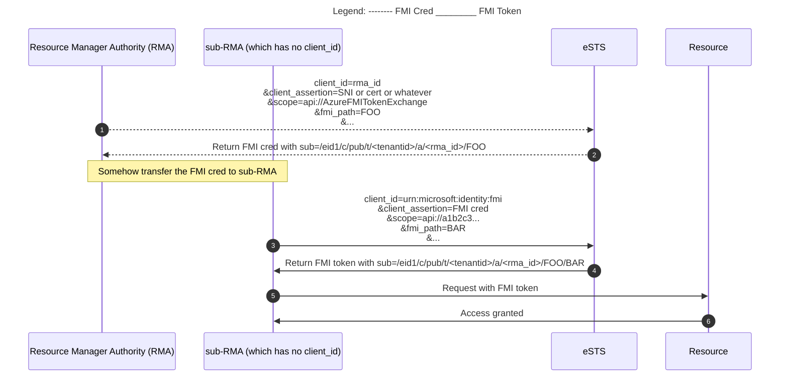

# FMI Flows

```mermaid
sequenceDiagram
title Legend: -------- FMI Cred  ________ FMI Token
autonumber
    participant RMA as Resource Manager Authority (RMA)
    participant sub-RMA as sub-RMA (which has no client_id)
    participant eSTS
    participant Resource

    RMA-->>eSTS: client_id=rma_id<br>&client_assertion=SNI or cert or whatever<br>&scope=api://AzureFMITokenExchange<br>&fmi_path=FOO<br>&...
    eSTS-->>RMA: Return FMI cred with sub=/eid1/c/pub/t/<tenantid>/a/<rma_id>/FOO

    Note over RMA, sub-RMA: Somehow transfer the FMI cred to sub-RMA

    sub-RMA->>eSTS: client_id=urn:microsoft:identity:fmi<br>&client_assertion=FMI cred<br>&scope=api://a1b2c3...<br>&fmi_path=BAR<br>&...
    eSTS->>sub-RMA: Return FMI token with sub=/eid1/c/pub/t/<tenantid>/a/<rma_id>/FOO/BAR

    sub-RMA->>Resource: Request with FMI token
    Resource->>sub-RMA: Access granted
```