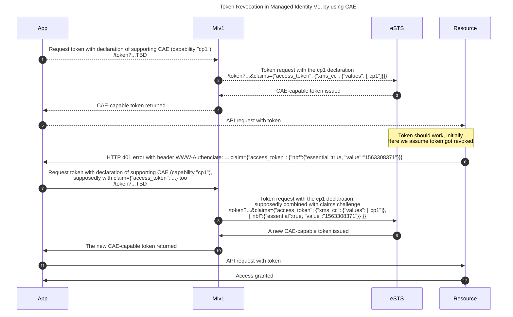

## Token Revocation in Managed Identity V1, by using CAE

```mermaid
sequenceDiagram
    autonumber
    title Token Revocation in Managed Identity V1, by using CAE
    participant App
    participant MIv1
    participant eSTS
    participant Resource

    App-->>MIv1: Request token with declaration of supporting CAE (capability "cp1") <br>/token?...TBD
    MIv1-->>eSTS: Token request with the cp1 declaration<br>/token?...&claims={"access_token": {"xms_cc": {"values": ["cp1"]}}}
    eSTS-->>MIv1: CAE-capable token issued
    MIv1-->>App: CAE-capable token returned
    App-->>Resource: API request with token

    note over Resource,eSTS: Token should work, initially. <br>Here we assume token got revoked.
    Resource->>App: HTTP 401 error with header WWW-Authenciate: ... claim={"access_token": {"nbf":{"essential":true, "value":"1563308371"}}}

    App->>MIv1: Request token with declaration of supporting CAE (capability "cp1"), <br>supposedly with claim={"access_token": ...} too <br>/token?...TBD
    MIv1->>eSTS: Token request with the cp1 declaration, <br>supposedly combined with claims challenge<br>/token?...&claims={"access_token": {"xms_cc": {"values": ["cp1"]}, <br> {"nbf":{"essential":true, "value":"1563308371"}} }}
    eSTS->>MIv1: A new CAE-capable token issued
    MIv1->>App: The new CAE-capable token returned
    App->>Resource: API request with token
    Resource->>App: Access granted
```
