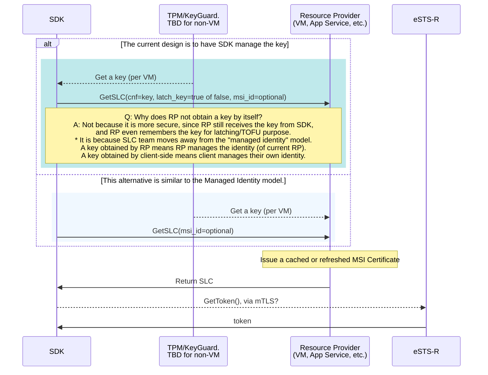

```mermaid
sequenceDiagram
    participant S as SDK
    participant K as TPM/KeyGuard.<br/>TBD for non-VM
    participant RP as Resource Provider<br/>(VM, App Service, etc.)
    participant E as eSTS-R
    alt The current design is to have SDK manage the key
        rect rgb(191, 233, 235)
        K-->>S: Get a key (per VM)
        S->>RP: GetSLC(cnf=key, latch_key=true of false, msi_id=optional)
        note over S,RP: Q: Why does RP not obtain a key by itself?<br/>A: Not because it is more secure, since RP still receives the key from SDK,<br/> and RP even remembers the key for latching/TOFU purpose.<br/>* It is because SLC team moves away from the "managed identity" model.<br/>A key obtained by RP means RP manages the identity (of current RP).<br/>A key obtained by client-side means client manages their own identity.
        end
    else This alternative is similar to the Managed Identity model.
        rect rgb(240,248,255)
        K-->>RP: Get a key (per VM)
        S->>RP: GetSLC(msi_id=optional)
        end
    end
    note over RP: Issue a cached or refreshed MSI Certificate
    RP->>S: Return SLC
    S-->>E: GetToken(), via mTLS?
    E->>S: token
```

